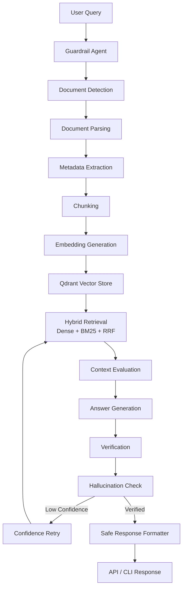
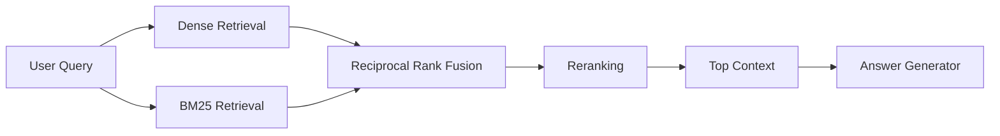
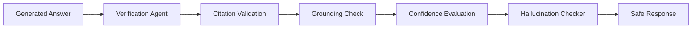

━━━━━━━━━━━━━━━━━━━━━━━━━━━━━━━━━━━━━━━━━━━━━━━━━━━━━━━━━━━━━━
# 🚀LODESTAR VERITAS


Hybrid Retrieval • LangGraph • Ollama • Qdrant
Verification • Guardrails • FastAPI • Docker

━━━━━━━━━━━━━━━━━━━━━━━━━━━━━━━━━━━━━━━━━━━━━━━━━━━━━━━━━━━━━━

> **Production-Style Agentic Multimodal Retrieval-Augmented Generation (RAG) Platform**
>
> An enterprise-inspired AI platform for financial and regulatory document intelligence, combining hybrid retrieval, LangGraph-style orchestration, verification, guardrails, and local LLM inference.

---


## 🌟 Overview

Lodestar Veritas is a modular, production-style Agentic AI system designed to answer questions from complex business documents while minimizing hallucinations through grounded retrieval and verification.

Unlike traditional RAG pipelines, Lodestar Veritas incorporates multiple intelligent agents responsible for ingestion, retrieval, query rewriting, answer generation, verification, hallucination detection, and response safety.

The project demonstrates production-oriented AI engineering practices including:

- Hybrid Retrieval (Dense + BM25 + RRF)
- LangGraph-style workflow orchestration
- Local LLM inference using Ollama
- Verification and hallucination detection
- Query rewriting and retry logic
- FastAPI REST API
- Docker deployment
- Comprehensive automated testing

# ✨ Features

| Category | Capability |
|----------|------------|
| 📄 Document Parsing | PDF, DOCX, CSV, Images |
| 🧠 Embeddings | SentenceTransformers |
| 🔍 Retrieval | Hybrid Retrieval (Dense + BM25) |
| ⚡ Ranking | Reciprocal Rank Fusion (RRF) |
| 🎯 Reranking | Context refinement |
| 🤖 LLM | Ollama Local Models |
| 🧭 Workflow | LangGraph-style Orchestration |
| 🔄 Query Rewriting | Automatic retry mechanism |
| ✅ Verification | Grounded answer validation |
| 🛡️ Guardrails | Query validation and safety |
| 🚨 Hallucination Detection | Confidence-based verification |
| 🌐 REST API | FastAPI |
| 🖥️ CLI | Interactive command-line interface |
| 🐳 Deployment | Docker & Docker Compose |
| 📊 Logging | Structured application logging |
| 🧪 Testing | 90+ automated pytest cases |

# 🛠️ Technology Stack

| Layer | Technologies |
|--------|--------------|
| Language | Python 3.11 |
| AI Framework | LangGraph-style Architecture |
| LLM | Ollama |
| Embeddings | SentenceTransformers |
| Vector Database | Qdrant |
| Retrieval | Dense + BM25 + RRF |
| API | FastAPI |
| Containerization | Docker |
| Testing | Pytest |
| Logging | Python Logging |


## 📁 Project Structure

```text
lodestar-veritas/
│
├── lodestar_veritas/
│   ├── agents/                 # Intelligent RAG agents
│   ├── api/                    # FastAPI application
│   ├── chunking/               # Chunking strategies
│   ├── embeddings/             # Embedding generation
│   ├── evaluation/             # Context evaluation
│   ├── guardrails/             # Query safety & validation
│   ├── ingestion/              # Document ingestion
│   ├── llm/                    # Ollama integration
│   ├── parsers/                # PDF, DOCX, CSV, Image parsers
│   ├── retrieval/              # Hybrid retrieval pipeline
│   ├── utils/                  # Shared utilities
│   ├── vectorstore/            # Qdrant integration
│   ├── verification/           # Answer verification
│   ├── cli.py
│   ├── config.py
│   ├── graph.py
│   └── state.py
│
├── tests/                      # Automated pytest suite
├── data/                       # Uploaded documents & indexes
├── Dockerfile
├── docker-compose.yml
├── requirements.txt
└── README.md
```

---

# 🏗️ Architecture

Lodestar Veritas follows a modular Agentic RAG architecture inspired by production AI systems.

Each responsibility is isolated into a dedicated component, making the system easier to maintain, extend, and test.

The workflow is orchestrated through a LangGraph-style state machine where every stage updates a shared workflow state before handing control to the next agent.

This design enables:

* Modular development
* Independent testing of each agent
* Retry and recovery mechanisms
* Easier debugging
* Production-oriented scalability

# 🤖 Agent Workflow



---

## Workflow Overview

The complete Agentic RAG workflow consists of multiple independent agents that communicate through a shared workflow state.

### Step 1 — Guardrails

* Validate the incoming user query.
* Block unsafe or unsupported requests.
* Prevent invalid workflow execution.

### Step 2 — Document Detection

* Detect document type automatically.
* Route files to the correct parser.
* Support PDF, DOCX, PPTX, CSV, XLSX, TXT, and images.

### Step 3 — Parsing

* Extract text from the uploaded documents.
* Preserve formatting whenever possible.
* Normalize content into a common structure.

### Step 4 — Metadata Extraction

* Generate metadata such as:

  * document name
  * page number
  * section title
  * headings
  * chunk identifiers

### Step 5 — Chunking

* Split documents into meaningful chunks.
* Preserve semantic boundaries.
* Maintain chunk overlap for retrieval quality.

### Step 6 — Embedding Generation

* Convert text chunks into dense vector embeddings.
* Use SentenceTransformers (all-MiniLM-L6-v2).
* Produce 384-dimensional embeddings.

### Step 7 — Vector Storage

* Store embeddings inside Qdrant.
* Associate vectors with metadata for retrieval.

### Step 8 — Hybrid Retrieval

The retrieval pipeline combines multiple retrieval techniques:

* Dense semantic retrieval
* BM25 keyword retrieval
* Reciprocal Rank Fusion (RRF)

This provides significantly better recall than using semantic search alone.

### Step 9 — Context Evaluation

* Evaluate whether sufficient context was retrieved.
* Trigger retries when confidence is low.

### Step 10 — Answer Generation

* Build prompts using retrieved context.
* Generate grounded answers with Ollama.
* Fall back to retrieved context if the LLM is unavailable.

### Step 11 — Verification

* Verify that generated answers are supported by retrieved evidence.
* Check citations.
* Validate confidence scores.

### Step 12 — Hallucination Detection

Detect potential hallucinations using:

* confidence thresholds
* citation validation
* context availability
* answer grounding

### Step 13 — Confidence Retry

When confidence falls below the configured threshold:

* rewrite the query
* perform retrieval again
* regenerate the answer
* repeat until the retry limit is reached

### Step 14 — Safe Response

Only verified and grounded answers are returned to the user.

Otherwise, the workflow produces a safe fallback response indicating insufficient evidence.

# 🧠 Agent Responsibilities

Lodestar Veritas is built using a modular agent-based architecture. Each agent performs a single responsibility and communicates through a shared `RAGState`, making the workflow maintainable, extensible, and production-friendly.

| Agent                        | Responsibility                                                                           | Input               | Output                      |
| ---------------------------- | ---------------------------------------------------------------------------------------- | ------------------- | --------------------------- |
| **Guardrail Agent**          | Validates incoming user queries and blocks unsafe requests.                              | User query          | Validated query / rejection |
| **Document Detection Agent** | Detects document type before parsing.                                                    | Uploaded file       | Document type               |
| **Parser Agent**             | Extracts text from supported document formats.                                           | File                | Raw extracted text          |
| **Metadata Agent**           | Generates metadata such as page number, section titles, headings, and chunk identifiers. | Parsed document     | Metadata-enriched document  |
| **Chunking Agent**           | Splits documents into semantically meaningful chunks.                                    | Parsed text         | Document chunks             |
| **Embedding Agent**          | Converts chunks into dense vector embeddings.                                            | Chunks              | Vector embeddings           |
| **Retrieval Agent**          | Retrieves relevant chunks using Hybrid Retrieval (Dense + BM25 + RRF).                   | User query          | Ranked document chunks      |
| **Context Evaluator Agent**  | Determines whether retrieved context is sufficient for answer generation.                | Retrieved chunks    | Context quality score       |
| **Query Rewrite Agent**      | Rewrites ambiguous or low-confidence queries for improved retrieval.                     | Original query      | Optimized query             |
| **Retrieval Router Agent**   | Routes retrieval requests through the appropriate retrieval strategy.                    | Query               | Retrieval execution         |
| **Answer Generator Agent**   | Generates grounded responses using Ollama or a fallback strategy.                        | Retrieved context   | Generated answer            |
| **Verification Agent**       | Verifies that the generated answer is supported by retrieved evidence.                   | Answer + context    | Verification result         |
| **Answer Verifier**          | Validates citations, confidence, and answer completeness.                                | Generated answer    | Validation report           |
| **Hallucination Checker**    | Detects unsupported or hallucinated responses.                                           | Answer + evidence   | Hallucination assessment    |
| **Confidence Retry Agent**   | Automatically retries retrieval and generation when confidence is low.                   | Verification result | Improved response           |
| **RAG Guardrails**           | Applies final quality and safety checks before returning the response.                   | Verified answer     | Safe response               |
| **Safe Response Formatter**  | Formats the final API/CLI response into a clean structure.                               | Final answer        | User response               |

---

## Shared Workflow State

All agents communicate through a shared **`RAGState`** object.

The workflow state contains information such as:

* User query
* Uploaded file paths
* Parsed documents
* Metadata
* Chunked text
* Retrieved chunks
* Generated answer
* Citations
* Sources
* Confidence score
* Verification results
* Guardrail warnings
* Retry count
* Workflow events

Using a shared state object allows every agent to contribute information without tightly coupling components together, following a LangGraph-inspired architecture.

# 🔍 Hybrid Retrieval Pipeline

Lodestar Veritas uses a **Hybrid Retrieval** architecture that combines semantic search with traditional keyword search to maximize retrieval accuracy and reduce hallucinations.

Unlike basic RAG systems that rely only on vector similarity, this project fuses multiple retrieval strategies before generating an answer.

---

## Retrieval Architecture



---

## Dense Semantic Retrieval

Semantic retrieval converts the user query into an embedding and searches the vector database for conceptually similar chunks.

### Advantages

* Understands meaning instead of exact wording
* Handles synonyms
* Supports natural language questions
* Finds relevant context even when wording differs

Example:

**Document**

```text
The organization reported increased quarterly earnings.
```

**User Query**

```text
How much did company profits grow?
```

Even though the word **profits** does not appear, semantic retrieval still finds the correct document because the embedding captures contextual meaning.

---

## BM25 Keyword Retrieval

BM25 is a statistical ranking algorithm that scores documents based on keyword frequency and rarity.

Unlike embeddings, BM25 performs exact keyword matching.

### Advantages

* Excellent for identifiers
* Product names
* Policy numbers
* Regulatory clauses
* Financial terminology
* Acronyms

Example:

```text
SEC Rule 17a-4
```

Semantic retrieval may not rank this highly, while BM25 immediately identifies the exact document.

---

## Reciprocal Rank Fusion (RRF)

Instead of choosing between semantic retrieval and keyword retrieval, Lodestar Veritas combines both ranking lists using **Reciprocal Rank Fusion (RRF)**.

RRF assigns higher scores to chunks that consistently rank well across multiple retrieval methods.

### Why use RRF?

* Better recall
* Better ranking stability
* Reduces missed documents
* Improves answer quality

Rather than depending on a single retrieval strategy, RRF leverages the strengths of both.

---

## Reranking

After retrieval, the candidate chunks are reranked using their relevance to the user query.

Instead of returning the first retrieved chunk, the system selects the most relevant evidence before answer generation.

Benefits include:

* Improved precision
* Better context quality
* Reduced irrelevant chunks
* Lower hallucination risk

---

## Retrieval Configuration

| Parameter              |            Value |
| ---------------------- | ---------------: |
| Vector Database        |           Qdrant |
| Embedding Model        | all-MiniLM-L6-v2 |
| Embedding Dimension    |              384 |
| Dense Top-K            |               15 |
| BM25 Top-K             |               15 |
| RRF Top-K              |               10 |
| Final Reranked Results |                5 |

---

## Why Hybrid Retrieval?

A purely semantic search system can miss exact identifiers.

A purely keyword-based system struggles with natural language.

Hybrid Retrieval combines both approaches to provide:

* Higher recall
* Better precision
* Improved grounding
* Stronger evidence selection
* Lower hallucination rates
* More reliable answers for financial and regulatory documents


# 🛡️ Guardrails & Safety

Lodestar Veritas incorporates multiple layers of validation and safety checks throughout the retrieval and generation pipeline.

Rather than relying solely on an LLM, the system evaluates the quality of both the input query and the generated response before returning results to the user.

---

## Query Guardrails

Before executing the retrieval workflow, every incoming query passes through the **Guardrail Agent**.

The Guardrail Agent performs:

* Query validation
* Empty query detection
* Unsupported request detection
* Basic safety filtering
* Workflow initialization checks

If a query fails validation, the workflow terminates gracefully with an appropriate response instead of continuing through unnecessary retrieval steps.

---

## Response Guardrails

After answer generation, the response passes through an additional layer of validation.

The response is checked for:

* Missing evidence
* Missing citations
* Empty responses
* Unsupported claims
* Low-confidence answers

Only responses that satisfy the configured quality criteria are returned to the user.

---

## Safe Response Formatting

The final response is formatted using the **Safe Response Formatter**, which produces a consistent response structure containing:

* Answer
* Confidence score
* Sources
* Citations
* Verification status
* Workflow events
* Guardrail warnings

This makes the API predictable and easier to integrate into downstream applications.

---

# ✅ Verification & Hallucination Detection

Producing an answer is not sufficient.

Every generated response is evaluated to determine whether it is actually supported by retrieved evidence.

---

## Verification Workflow



---

## Verification Agent

The Verification Agent evaluates whether:

* An answer exists
* Supporting context exists
* Citations are available
* Confidence exceeds the configured threshold
* The response is grounded in retrieved evidence

The verification result becomes part of the shared workflow state and is available to downstream components.

---

## Hallucination Detection

The Hallucination Checker analyzes generated responses for signs of unsupported content.

Signals include:

* Missing retrieved context
* Missing citations
* Low confidence
* Unsupported statements
* Empty evidence

If hallucination risk is detected, the workflow can:

* Trigger query rewriting
* Retry retrieval
* Regenerate the answer
* Return a safe fallback response

instead of presenting unsupported information to the user.

---

## Confidence-Based Retry

When verification determines that confidence falls below the configured threshold:

1. The original query is rewritten.
2. Retrieval is executed again.
3. New context is evaluated.
4. A new answer is generated.
5. Verification is repeated.

This retry mechanism increases the likelihood of producing grounded, evidence-backed responses while reducing hallucinations.

---

## Why This Matters

Many traditional Retrieval-Augmented Generation (RAG) systems generate responses immediately after retrieval.

Lodestar Veritas introduces additional validation layers to ensure that responses are:

* Grounded
* Explainable
* Verifiable
* Supported by retrieved evidence
* Safer for enterprise document intelligence applications

These verification and guardrail mechanisms help improve response reliability while reducing the risk of hallucinated or unsupported answers.

# 🚀 Installation & Quick Start

## Prerequisites

Before running Lodestar Veritas, ensure the following software is installed:

| Software       | Version |
| -------------- | ------- |
| Python         | 3.11+   |
| Docker         | Latest  |
| Docker Compose | Latest  |
| Ollama         | Latest  |
| Git            | Latest  |

---

## Clone the Repository

```bash
git clone https://github.com/<your-github-username>/lodestar-veritas.git

cd lodestar-veritas
```

---

## Create a Virtual Environment

### Windows

```bash
python -m venv .myenv

.myenv\Scripts\activate
```

### macOS / Linux

```bash
python3 -m venv .myenv

source .myenv/bin/activate
```

---

## Install Dependencies

```bash
pip install --upgrade pip

pip install -r requirements.txt
```

---

## Configure the Environment

Copy the example configuration file:

```bash
cp .env.example .env
```

Update the values if required.

Example:

```ini
OLLAMA_URL=http://localhost:11434
OLLAMA_MODEL=qwen2.5:3b

VECTOR_DB=qdrant

COLLECTION_NAME=lodestar_veritas
```

---

# 🐳 Running with Docker

Build the project:

```bash
docker compose up --build
```

The API will become available at:

```
http://localhost:8000
```

Swagger Documentation:

```
http://localhost:8000/docs
```

Health Endpoint:

```
http://localhost:8000/health
```

---

# 💻 Running Locally

Start the FastAPI server:

```bash
uvicorn lodestar_veritas.api.main:app --reload
```

---

Run the interactive CLI:

```bash
python -m lodestar_veritas.cli
```

---

# 🌐 REST API

## Root Endpoint

```http
GET /
```

Example Response

```json
{
    "message": "Lodestar Veritas API is running.",
    "version": "1.0.0",
    "docs": "/docs",
    "health": "/health"
}
```

---

## Health Check

```http
GET /health
```

Response

```json
{
    "status": "healthy",
    "service": "lodestar-veritas-api",
    "version": "1.0.0"
}
```

---

## Version

```http
GET /version
```

Response

```json
{
    "version": "1.0.0",
    "name": "Lodestar Veritas",
    "type": "Agentic Multimodal RAG Platform"
}
```

---

## Ask a Question

```http
POST /ask
```

Request

```json
{
    "query": "What increased in 2024?",
    "file_paths": [
        "sample.pdf"
    ]
}
```

Example Response

```json
{
    "query": "What increased in 2024?",
    "answer": "...",
    "confidence": 0.94,
    "verified": true,
    "sources": [],
    "citations": [],
    "workflow_events": []
}
```

---

# 🖥️ Command Line Interface

Start the CLI:

```bash
python -m lodestar_veritas.cli
```

Example:

```text
========================================================
            Lodestar Veritas - Agentic RAG CLI
========================================================

Ask a question:

> What increased in 2024?

Answer

Revenue increased by 25% in 2024.

Confidence

0.95

Verification

Passed

Workflow Events

• Guardrail Agent
• Retrieval Agent
• Verification Agent
• Safe Response Formatter
```
# 🧪 Testing & Project Quality

Lodestar Veritas follows a test-driven, production-oriented development approach.

Every major workflow component is validated through automated unit and integration tests to ensure correctness, maintainability, and long-term reliability.

---

## Running the Test Suite

Execute the complete test suite using:

```bash
pytest
```

Example output:

```text
============================= test session starts =============================

90+ tests collected

90+ passed

0 failed
```

---

## Test Coverage

The automated test suite validates:

### Agent Layer

* Guardrail Agent
* Query Rewrite Agent
* Retrieval Router Agent
* Retrieval Agent
* Context Evaluator Agent
* Answer Generator Agent
* Verification Agent
* Confidence Retry Agent

---

### Retrieval Pipeline

* Dense Retrieval
* BM25 Retrieval
* Hybrid Retrieval
* Reciprocal Rank Fusion (RRF)
* Reranking

---

### API Layer

* Root endpoint
* Health endpoint
* Version endpoint
* Ask endpoint

---

### Workflow

* LangGraph-style workflow execution
* Shared workflow state
* Retry mechanism
* Context evaluation
* Verification pipeline

---

### Utilities

* Configuration
* Logging
* Citation formatting
* Safe response formatting

---

# 📊 Project Highlights

| Capability                | Status |
| ------------------------- | :----: |
| Multi-format Parsing      |    ✅   |
| Hybrid Retrieval          |    ✅   |
| BM25 Retrieval            |    ✅   |
| Dense Retrieval           |    ✅   |
| Reciprocal Rank Fusion    |    ✅   |
| Reranking                 |    ✅   |
| LangGraph-style Workflow  |    ✅   |
| Shared Workflow State     |    ✅   |
| Query Rewriting           |    ✅   |
| Retrieval Routing         |    ✅   |
| Context Evaluation        |    ✅   |
| Confidence Retry          |    ✅   |
| Verification              |    ✅   |
| Hallucination Detection   |    ✅   |
| Safety Guardrails         |    ✅   |
| Ollama Integration        |    ✅   |
| FastAPI                   |    ✅   |
| CLI                       |    ✅   |
| Docker                    |    ✅   |
| Docker Compose            |    ✅   |
| Environment Configuration |    ✅   |
| Structured Logging        |    ✅   |
| Automated Testing         |    ✅   |

---

# ⚙️ Production-Oriented Design

Lodestar Veritas was designed using software engineering principles commonly adopted in enterprise AI systems.

### Design Goals

* Modular architecture
* Single-responsibility agents
* Shared workflow state
* Explainable retrieval
* Grounded answer generation
* Configuration-driven deployment
* Local-first LLM support
* Docker deployment
* Automated testing
* Easy extensibility

The architecture allows individual components to evolve independently while maintaining a clean and maintainable workflow.

---

# 🗺️ Roadmap

## ✅ Version 1.0

Completed features:

* Agentic RAG workflow
* Multi-format document ingestion
* Hybrid retrieval
* LangGraph-style orchestration
* Query rewriting
* Retrieval routing
* Context evaluation
* Verification pipeline
* Hallucination detection
* Safety guardrails
* FastAPI
* CLI
* Docker support
* Automated testing

---

## 🚀 Version 1.1

Planned improvements:

* Streaming responses
* Authentication
* Enhanced observability
* Better retrieval metrics
* Performance optimizations
* Improved reranking strategies

---

## 🚀 Version 2.0

Future enterprise enhancements:

* Native LangGraph execution
* Multi-agent planner
* Redis semantic caching
* Qdrant Cloud deployment
* OCR for scanned documents
* Advanced table understanding
* Image reasoning
* SQL Agent
* Web Search Agent
* Memory-enabled conversations
* LangSmith / OpenTelemetry tracing
* Kubernetes deployment
* CI/CD pipeline

---

# 🤝 Contributing

Contributions, bug reports, feature requests, and suggestions are welcome.

If you would like to contribute:

1. Fork the repository.
2. Create a feature branch.
3. Implement your changes.
4. Add or update tests.
5. Submit a Pull Request.

---

# 📄 License

This project is released under the MIT License.

See the `LICENSE` file for details.

---

# 🙏 Acknowledgements

Lodestar Veritas was developed as a production-style Agentic AI portfolio project demonstrating modern Retrieval-Augmented Generation (RAG) techniques, hybrid retrieval, workflow orchestration, verification, and AI safety practices.

The project draws inspiration from the broader open-source AI ecosystem, including LangGraph, LangChain, FastAPI, Ollama, Qdrant, SentenceTransformers, and the Python community.

---

# 👨‍💻 Author

**Madhukar Goli**

AI Systems Engineer

GenAI • Agentic AI • Retrieval-Augmented Generation • Machine Learning • Data Engineering

If you found this project useful, consider giving it a ⭐ on GitHub.
